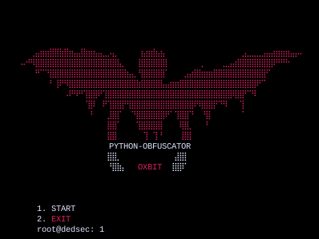

<h1 align="center"> DEDSEC PYTHON OBF</h1>
<h4 align="center"> Dedsec OBF  is a Python Script Obfuscation Tool, that can be used to Obfuscate your python code. </h4>

### INSTALLATION
* git clone https://github.com/0xbitx/Dedsec-Python-OBF.git
* cd Dedsec-Python-OBF
* python3 dedsec-python-obf.py

### TESTED ON FOLLOWING:
* Kali Linux
* Parrot OS
* Ubuntu

### LANGUAGE 
* Python

<h1 align="center"> DISCLAIMER </h1>

<h4 align="center">I'm not responsible for anything you do with this program, so please only use it for good and educational purposes. </h4>
